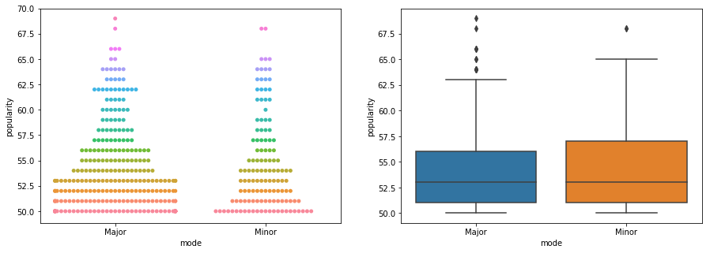

# Introduction to Biomedical Data Science
*Marion Pang (mpangwa1)*
## Final Project
### Predicting Song Popularity using Audio Features by Multivariable Linear Regression


```python
# import libraries
import numpy as np
from scipy import stats as st
import pandas as pd
import seaborn as sns
import matplotlib.pyplot as plt
import statsmodels.formula.api as smf
import statsmodels as sm
import sklearn as skl
import sklearn.metrics as skm

! if [ ! -e SpotifyFeatures.csv ] ; \
  then wget https://raw.githubusercontent.com/gnaprs/DataScience_MarionPang/master/AnalysisProject/ultimate-spotify-tracks-db/SpotifyFeatures.csv; \
fi
```


```python
# reading in data
projectData = pd.read_csv("/content/SpotifyFeatures.csv").drop(['track_id', 'valence'],\
             axis = 1)

# keys: ['genre', 'artist_name', 'track_name', 'popularity', 'acousticness',
#       'danceability', 'duration_ms', 'energy', 'instrumentalness', 'key',
#       'liveness', 'loudness', 'mode', 'speechiness', 'tempo',
#       'time_signature']

# unique genres: ['Movie' 'R&B' 'A Capella' 'Alternative' 'Country' 'Dance' 'Electronic'
# 'Anime' 'Folk' 'Blues' 'Opera' 'Hip-Hop' "Children's Music"
# 'Children’s Music' 'Rap' 'Indie' 'Classical' 'Pop' 'Reggae' 'Reggaeton'
# 'Jazz' 'Rock' 'Ska' 'Comedy' 'Soul' 'Soundtrack' 'World']
```


```python
# projectData[projectData['genre']=='Movie'].sort_values(by=['popularity'],ascending=False)

classicalData = projectData[projectData['genre']=='Classical']
classicalData = classicalData[classicalData.popularity >= 10]

# preliminary data analysis, pairplot to find variables with correlation

classicalMean = classicalData.groupby(['popularity']).mean()
classicalMean['popularity']=classicalMean.index

CDM1 = sns.pairplot(classicalMean,y_vars=["popularity"],x_vars=["acousticness","danceability","duration_ms","energy","instrumentalness"],kind="reg")
CDM1.set(ylim=(-10, 100))
CDM2 = sns.pairplot(classicalMean,y_vars=["popularity"],x_vars=["liveness","loudness","speechiness","tempo"],kind="reg")
CDM2.set(ylim=(-10, 100))
plt.show()

# splitting up data into training and testing set
trainFraction = .30
sample = np.random.uniform(size = classicalData.shape[0]) < trainFraction

classicalTrain = classicalData[sample]
classicalTest = classicalData[~sample]

# modeling popularity with OLS model
classicalTrainMean = classicalTrain.groupby(['popularity']).mean()
classicalTrainMean['popularity']=classicalTrainMean.index

results = smf.ols('popularity ~ acousticness + speechiness + instrumentalness + liveness', data = classicalTrainMean).fit()
print(results.summary2())
```


                       Results: Ordinary least squares
    =====================================================================
    Model:                OLS               Adj. R-squared:      0.568   
    Dependent Variable:   popularity        AIC:                 448.9744
    Date:                 2019-10-06 21:40  BIC:                 459.2766
    No. Observations:     58                Log-Likelihood:      -219.49 
    Df Model:             4                 F-statistic:         19.74   
    Df Residuals:         53                Prob (F-statistic):  5.34e-10
    R-squared:            0.598             Scale:               124.06  
    ---------------------------------------------------------------------
                       Coef.   Std.Err.    t    P>|t|    [0.025   0.975] 
    ---------------------------------------------------------------------
    Intercept         104.0369  18.9055  5.5030 0.0000   66.1174 141.9565
    acousticness      -59.0218  18.1056 -3.2599 0.0020  -95.3370 -22.7066
    speechiness      -143.6381 131.5060 -1.0923 0.2797 -407.4058 120.1296
    instrumentalness   33.3890  12.5054  2.6700 0.0100    8.3064  58.4716
    liveness         -185.6042  47.3051 -3.9236 0.0003 -280.4861 -90.7222
    ---------------------------------------------------------------------
    Omnibus:               0.959          Durbin-Watson:            0.494
    Prob(Omnibus):         0.619          Jarque-Bera (JB):         1.001
    Skew:                  -0.196         Prob(JB):                 0.606
    Kurtosis:              2.489          Condition No.:            134  
    =====================================================================
    
    


```python
# predict results using training set

classicalTrainMean["pred"]=results.predict(exog=classicalTrainMean)
sample_num=range(0,classicalTrainMean.shape[0])

sns.scatterplot(sample_num, classicalTrainMean["popularity"])
sns.scatterplot(sample_num, classicalTrainMean["pred"])
plt.legend(("Actual", "Predicted"))
plt.title("Training Data")
plt.text(15, 65, "$r^2$ = 0.598", horizontalalignment='left', size='medium', color='black', weight='semibold')
plt.text(15, 60, "MSE = 113.36", horizontalalignment='left', size='medium', color='black', weight='semibold')
plt.show()

print(skm.r2_score(classicalTrainMean["popularity"],classicalTrainMean["pred"]))
print(skm.mean_squared_error(classicalTrainMean["popularity"],classicalTrainMean["pred"]))

# predict results using testing set
classicalTestMean = classicalTest.groupby(['popularity']).mean()
classicalTestMean['popularity']=classicalTestMean.index

classicalTestMean["pred"]=results.predict(exog=classicalTestMean)
sample_num=range(0,classicalTestMean.shape[0])

sns.scatterplot(sample_num, classicalTestMean["popularity"])
sns.scatterplot(sample_num, classicalTestMean["pred"])
plt.legend(("Actual", "Predicted"))
plt.title("Testing Data")
plt.text(15, 65, "$r^2$ = 0.563", horizontalalignment='left', size='medium', color='black', weight='semibold')
plt.text(15, 60, "MSE = 123.04", horizontalalignment='left', size='medium', color='black', weight='semibold')
plt.show()

print(skm.r2_score(classicalTestMean["popularity"],classicalTestMean["pred"]))
print(skm.mean_squared_error(classicalTestMean["popularity"],classicalTestMean["pred"]))


```


    0.598385967782928
    113.36893180956118
    


    0.562529384264929
    123.03848063071588
    


```python
# looking at most popular keys and modes
classicalPopData = classicalData[classicalData.popularity >= 50]

fig, ax = plt.subplots(1,2,figsize=(15,5))
d=sns.swarmplot(x="key", y="popularity", hue="popularity", data=classicalPopData, ax=ax[0])
d.legend_.remove()
sns.boxplot(x="key", y="popularity", data=classicalPopData, ax=ax[1])
fig.show()


fig, ax = plt.subplots(1,2,figsize=(15,5))
d=sns.swarmplot(x="mode", y="popularity", hue="popularity", data=classicalPopData, ax=ax[0])
d.legend_.remove()
sns.boxplot(x="mode", y="popularity", data=classicalPopData, ax=ax[1])
fig.show()

# no clear trend here!
```




